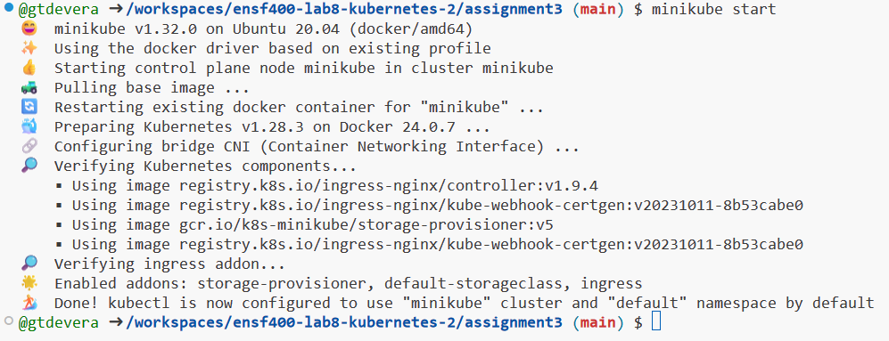
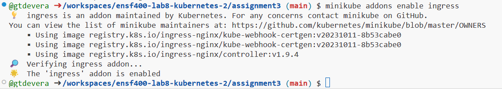
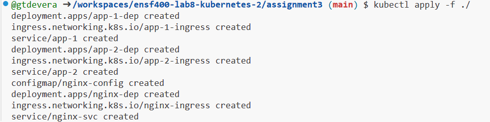
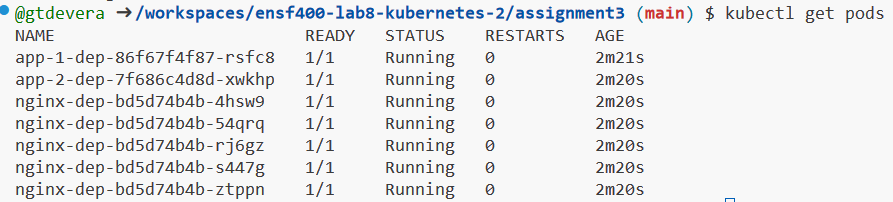
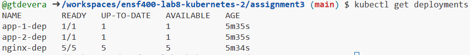
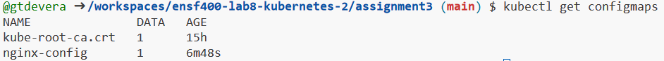
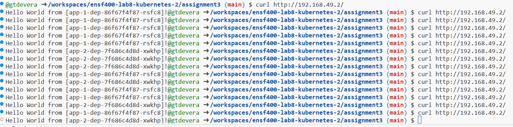

# Initial Setup:

Start with:
```
minikube start
```
You will get this:



Make sure to run:
```
minikube addons enable ingress
kubectl apply -f ./
```
Ingress:



Outcome of the .yaml files:



# Optional Debugging

Use the below for debugging:
```
kubectl describe pod pod_name
kubectl logs pod_name
```

# Check to See if it Worked

In order to see if the pods and deployments work run these commands:
```
kubectl get pods
kubectl get deployments
kubectl get configmaps
```
Result from getting pods:



Result from getting deployments:



Result from getting configmaps:



# Running Curl

Make sure to run this command in order to get the ip of Minikube:
```
minikube ip
```
and then use this command for the curl:

```
curl http://<minikube ip>/
```

Here is the result from running the command multiple times



# Deleting Pods, Deployments, etc.

Get rid of all resources
```
kubectl delete -f ./
```

Stop Minikube
```
minikube stop
```